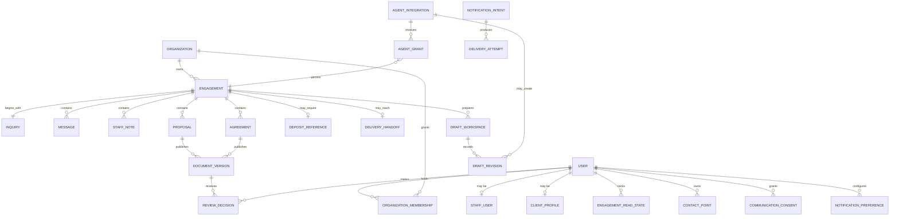

# Client Portal Domain Model

## Status

**Current design direction — not approved for implementation.** This document
extends the architecture in [the revised client portal plan](./revised-plan.md).
It defines the portal's business concepts and boundaries. Authentication,
session, credential, and identity-verification mechanics are defined in the
[authentication design](./authentication-design.md).

The model is intentionally forward-looking. It is not a database migration,
API contract, production-readiness claim, or record of a real client.

## Purpose and boundary

The client portal is a collaboration surface for moving a prospective client
from an initial inquiry to an approved agreement and deposit. It preserves the
commercial discussion and human decisions that lead to an engagement. After a
deposit is confirmed, delivery conversation moves primarily to Slack while the
portal remains available for commercial context.

The portal is not the authoritative system for:

- Electronic signatures or legal signing evidence.
- Invoices, payments, receipts, or financial reconciliation.
- Project-delivery conversation after the Slack handoff.
- Autonomous publication or execution of AI-generated work.

Stripe remains authoritative for invoices and payments. A selected external
signature provider will remain authoritative for any legally binding signing
ceremony.

## Model overview



The diagram shows the important conceptual relationships, not a required
physical schema. Shared concepts may be represented by separate tables or
typed records when implementation evidence justifies that choice.

## Identity and tenancy

### User

`User` is the stable application identity. Its identifier is an immutable UUID;
email addresses and phone numbers are attributes, not foreign keys or durable
identifiers. A user may be a staff user, a client profile, or both if a future
use case requires it.

### Staff user

`StaffUser` represents an authorized member of the consulting practice. Staff
authority is independent of client organization membership. Todd initially
holds the administrative staff role and may qualify inquiries, create or link
organizations, invite clients, publish documents, designate approvers, record
external payment observations, and manage agent integrations.

### Client profile

`ClientProfile` holds client-facing profile information and references the
user's verified contact points. It does not determine access by itself. Access
comes from active organization membership.

### Organization and membership

`Organization` is the tenant boundary for authenticated client access. An
`OrganizationMembership` links a user to an organization with an explicit
client role and lifecycle state. An active member may view and discuss the
organization's engagements. Structured proposal or agreement approval also
requires designation as the approver for the applicable document.

An organization may have multiple members and engagements. Membership never
grants access to another organization, and interface filtering is not an
authorization control.

### Invitation

`Invitation` records Todd's intent to add a particular email address to an
organization. It has an expiry and can be accepted, revoked, or replaced. The
invitation process and account proof are described in the authentication
design; accepting an invitation activates the corresponding membership.

## Commercial engagement

### Inquiry

`Inquiry` is untrusted information submitted by an unauthenticated prospective
client through the public consulting site. It preserves the structured form
fields, submitter contact snapshot, receipt time, source, idempotency key, and
qualification outcome. It does not grant portal access.

A public submission creates an inquiry and a staff-only prequalification
`Engagement` atomically. Todd may mark the inquiry as qualified, declined, or
spam. Qualification creates or links an organization and permits invitations
without losing the original inquiry history.

### Engagement

`Engagement` is the durable container for inquiry context, conversation,
commercial documents, review decisions, deposit observation, and delivery
handoff. Its normal lifecycle is:

```text
prospect -> negotiating -> awaiting_deposit -> delivery -> closed
```

Declined and spam inquiries end before negotiation. The normal commercial path
is flexible: Todd may publish multiple proposals, skip a proposal when it is
unnecessary, or withdraw an obsolete document.

Before qualification, an engagement has no client organization and is visible
only to staff. Once linked to an organization, active members receive access
through that organization boundary.

### Proposal and agreement

`Proposal` and `Agreement` are distinct commercial document types with shared
review behavior. Each has:

- A staff-only draft workspace for human and AI-assisted authoring.
- Zero or more attributed draft revisions.
- One current published version and immutable prior published versions.
- One designated client approver at a time.
- Version-specific review decisions.

Published versions contain an immutable native-content snapshot, content hash,
version number, publisher, and publication time. A PDF export or external
canonical-document reference is an optional derivative, not the identity of
the version.

The review lifecycle is:

```text
draft -> in_review -> changes_requested | approved
                    -> superseded | withdrawn
```

An active organization member may discuss a version. Only its designated
approver may request changes or approve it. Publishing a replacement closes
outstanding review requests and supersedes the previous current version.
Historical comments and decisions remain attached to their original version
and never transfer to a replacement.

Agreement approval is authenticated business approval of the displayed
version. It must not be described as an electronic signature. If legal signing
is required, the portal links the approved version to an external provider's
authoritative process.

### Draft workspace and AI assistance

`DraftWorkspace` is private to staff and exists separately from published
versions. `DraftRevision` preserves the content, creator, creation time, and
available workflow or model provenance. It supports comparison and recovery
without presenting internal generation attempts to clients.

AI output is always a draft. An agent cannot publish it, send it to a client,
make a review decision, or cause an external action. A staff user must select
and publish the client-visible content.

## Conversation and activity

### Messages and notes

`Message` is an authored, client-visible contribution to an engagement. It may
be general discussion or reference exactly one immutable proposal or agreement
version. A formal change request remains a review decision even when it also
contains explanatory text.

`StaffNote` is a separately authorized internal record. It must not be exposed
by client queries, serialization, search, or timeline projection. Per-item UI
hiding is not an authorization boundary.

### Timeline projection

The chat-like timeline is a read model rather than the source of business
truth. It merges client-visible messages and append-only domain activity such
as document publication, review decisions, agreement approval, deposit
confirmation, and Slack handoff.

Items sort by occurrence time and then a stable unique identifier, oldest at
the top and newest at the bottom. Internal views may additionally merge staff
notes, inquiry qualification events, agent activity, and draft events.

`EngagementReadState` stores each member's last observed position. It supports
unread counts, suppresses notifications for already-viewed activity, and does
not alter the timeline records.

## External handoffs

### Deposit reference

`DepositReference` is a synchronized observation, not a financial ledger. It
references the approved agreement version, Stripe invoice identifier and
hosted link, observed deposit state, observation source, recorder, and
timestamp. Initial operation is manual; a later verified webhook may provide
the same domain observation idempotently.

Recording a received deposit moves the engagement to `delivery`. The portal
does not duplicate invoice line items, numbering, payment methods, receipts,
taxes, disputes, or reconciliation.

### Delivery handoff

`DeliveryHandoff` records when and by whom the primary interaction moved to
Slack, with an optional stable destination reference. After handoff, the portal
remains readable and supports secondary commercial discussion, but Slack owns
the delivery conversation.

## Notifications and contact preferences

`ContactPoint` represents a verified email address or E.164 mobile number.
Authentication proves or changes contact points as described in the
authentication design.

`CommunicationConsent` records the channel, consent state, wording version,
collection source, timestamp, and available evidence. A verified mobile number
is required for a client account, but SMS activity notifications require a
separate, optional, revocable consent.

`NotificationPreference` records SMS eligibility, recipient timezone, and
quiet-hour behavior. SMS is the primary portal-activity channel when consented;
email is the fallback and remains the required channel for invitations,
recovery, email changes, and security notices.

`NotificationIntent` is generated from a committed domain event. It identifies
the recipient, category, safe deep-link destination, aggregation key, and
delivery policy. `DeliveryAttempt` records provider identifiers, status,
timestamps, and sanitized errors. Delivery failure never reverses the business
action that produced the notification.

Initial client notification categories are:

- New client-visible messages.
- Published or replaced proposals and agreements.
- Review or approval requests requiring client action.
- Confirmed deposit and Slack handoff.

The system suppresses self-notifications and activity the recipient has
already viewed. Ordinary message bursts are coalesced for five minutes.
Non-security SMS waits until 8:00 a.m.–8:00 p.m. in the recipient's timezone.
Messages identify the consultancy, describe only the activity category, and
link to the portal without including client content, terms, or amounts.

SMS initially provides notifications only. Standard opt-in, opt-out, and help
keywords update consent through verified, idempotent provider events. Other
replies direct the client to continue in the portal and do not become timeline
messages.

## AI agent integration

`AgentIntegration` is a named, Todd-owned machine principal. It never
impersonates a human user. `AgentGrant` combines explicit capabilities with an
allowlist of organizations or individual engagements.

Within an allowed engagement, a granted agent may read inquiry content,
client-visible activity, published documents, staff notes, and existing drafts.
Draft-write access permits new private draft artifacts and attributed draft
revisions. It does not permit deletion of history.

Agents cannot:

- Expand their own grants.
- Publish documents or send client-visible messages.
- Invite members or change tenant access.
- Request, make, or record a client approval.
- Change deposit state or record delivery handoff.
- Directly create client notification intents.

The portal exposes agent capabilities through the same versioned JSON:API
boundary used by the application. Credential authentication and lifecycle are
defined in the authentication design.

## Invariants and validation scenarios

- A public inquiry can be created but never read through an unauthenticated
  interface.
- Prequalification engagements and all staff notes and drafts are inaccessible
  to clients.
- Membership grants access only within its organization.
- A review decision identifies the exact immutable version and designated
  approver.
- A replacement version never inherits approval from the version it replaces.
- An agent can access only granted resources and can produce only private
  drafts.
- Agent drafts cannot produce notifications.
- A deposit observation cannot become a parallel Stripe ledger.
- Notification retries are idempotent and do not duplicate the originating
  domain action.
- Timeline order is deterministic when items share a timestamp.

## Deferred decisions

Physical tables, JSON:API resource shapes, retention periods, production rate
limits, provider reconciliation schedules, signature-provider selection, and
international messaging policy require separately reviewed implementation
plans.
